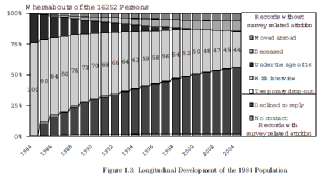

# Structure of SOEP

- started in 1984

- extended by special topics
- SOEP samples
    - sample A - residents of FRG
    - sample B - foreigners in the FRG
    - sample C - German residents in the GDR
    - sample D - Immigrants
    - sample E - Refreshment
    - ...

## Who is interviewed

- Interviews with all household members older than 17 years
- Proxy information on children
- Persons moving in or leaving SOEP household

- Individual Questionnaire: Every household member which is born in current
  year - 18 is eligible to answer the questions
- Household Questionnaire: The head of the household answers questions related
  to the household, finances, etc.
- Youth Questionnaire: Every person who is born in current year - 17 is
  eligible to answer
- Biography Supplement: This questionnaire is different for persons answering
  the youth questionnaire and extends biographical information
- Mother and Child Questionnaire: These questions are answered with the help of
  the mother for different periods of the children's age
- Pre-teen Questionnaire and Early Youth Questionnaire

## What is measured

**Stable questions**

- population and demography
- education, training and qualification
- labor market and occupational dynamics
- earnings, income and social security
- housing
- health
- household production
- basic orientation (preferences, values, etc.) and satisfaction with life
  in general and certain aspects of life

**Rotating questions**

- family and social networks (1991, every 5 years)
- time use and preferences (1990, 95, 98, and then every 5 years)
- further education or training (1989, 1993, 2000, and then every 4 years)
- social security, assets (2002, every 5 years)
- ecology and environmental behavior (1998, 2003, 2015)
- Big Five (2005, 2009, 2013)
- Locus of Control (2005, 2010, 2015)

# Interview Methodology and Survey Instruments

- Interviewer tries to obtain face-to-face interviews with all members of the
household aged 16 and above (Personal, Biography)
- head of house answers questions related to the household, housing costs,
sources of income, questions about children younger than 16 (kindergarten,
etc.)

# Development of Survey Size

# Principles of Data Structure

- Since individuals are questioned every year, the underlying structure of the
  SOEP is cross-sectional. Each wave has its datasets called $P for individual
  respondents, $KIND for children, etc..
- Static variables like years of education are generated by the SOEP team and
  are stored in files like $PGEN for personal or $HGEN for household
  information
- spell data is named with capital letter like ARTKALEN for employment status
  and EINKALEN for income
- YPBRUTTO contains information about drop-out on the individual level
- BIOPAREN contains biography information about parents, BIOBIRTH contains
  birth information on women, BIOBRTHM on men, BIOJOB on first occupation,
  BIOIMMIG on immigration, etc.

# Introduction to Biography Data

- BIOCHILD is concerned with newborn children and was first applied to mothers
in 2003. Follow-up interviews are planned for critical ages (3, 6, 12)

# The Youth Questionnaire and BIOYOUTH

The questionnaire is applied since 2000 on the birth cohort of 1984 and tries
to collect additional biography information for respondents aged 16 or 17 on
relationship to parents, leisure time activities and some personal
characteristics like LOC-related questions.

Variables related to LOC

- BYESVERL: What happens in life depends on me
- BYESERRE: Did not reach what I deserve
- BYESGLUE: What you achieve is a matter of luck
- BYESAND: Others decide about my life
- BYESHART: You have to work hard for success
- BYESZWEI: By difficulties, doubt about own abilities
- BYESSOZU: Chances are determined by social circumstances
- BYESFAEH: Abilities are more important than efforts
- BYESKNTR: Little control over events in my life
- BYESENGA: Change of social circumstances through social/political activities

# Mothers and Child Questionnaire: BIOCHILD

There exist variables for the relationship between mothers and children after
birth which should also include variables about whether the pregnancy was
planned vs unplanned and whether the child is disabled or not.

# Locus of Control

Locus of Control in the SOEP is measured concentrating on seven items, since
one item is ambiguous

- Others make crucial decision in my life
  - Personal questionnaire: 2005 (vp12705), 2010 (bap0205), 2015 (bfp0505)
- Compared to others I have not achieved what I deserved
  - Personal questionnaire: 2005 (vp12702), 2010 (bap0202), 2015 (bfp0502)
- Have little control over events in my life
  - Youth questionnaire: 2006 (wj9009) - 2014 (bej9209)
- Little control over my life
  - Personal questionnaire: 1999 (pp10710)
- Have control over own life
  - Personal questionnaire: 1994 (kp7101), 1995 (lp0801), 1996 (mp1001)

- LOC in 2005, 2010, 2015 has 15 items as well as the Personal questionnaire
- LOC in 1999 has only 10 items
